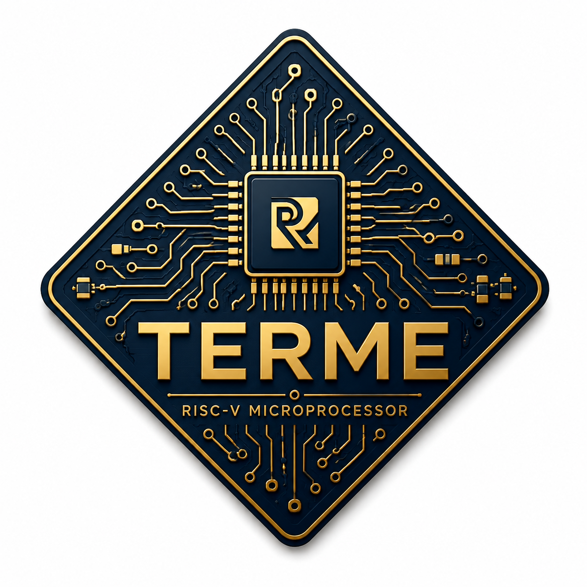
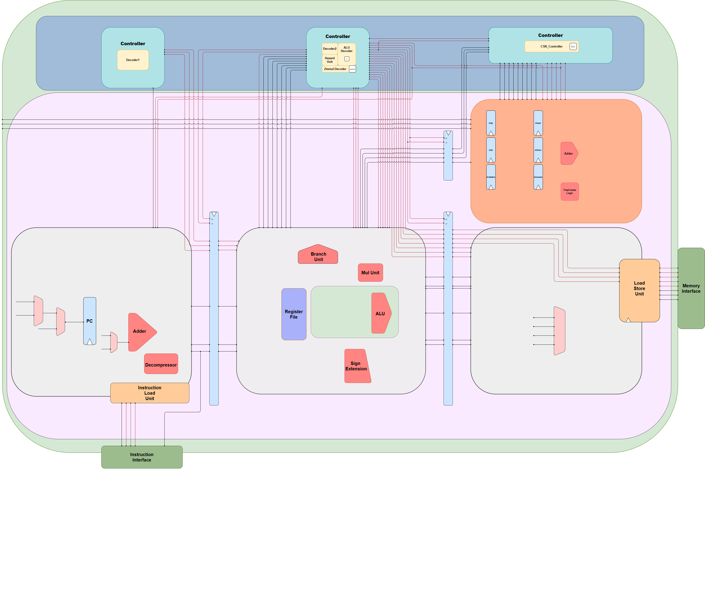

  

<h1 align="center">TERME</h1>

  <b>Three-stage Embedded RISC-V Microprocessor Engine</b>

  A compact 32-bit in-order RISC-V processor implemented in SystemVerilog
  for embedded and ASIC-oriented applications.

---

## Overview

TERME is a custom 32-bit RISC-V processor designed around a compact
three-stage in-order pipeline.

The processor currently implements:

- RV32I base integer ISA
- RISC-V compressed instructions (C)
- Zicsr CSR instructions
- Zmmul multiplication instructions
- Machine-mode CSR and interrupt handling
- Load/store support
- Separate instruction and data memory interfaces

The processor is primarily intended as a small embedded RISC-V core with
an emphasis on low area, low power, synthesizability, and clean
microarchitecture.

## Architecture

TERME uses the following three-stage pipeline:

  

